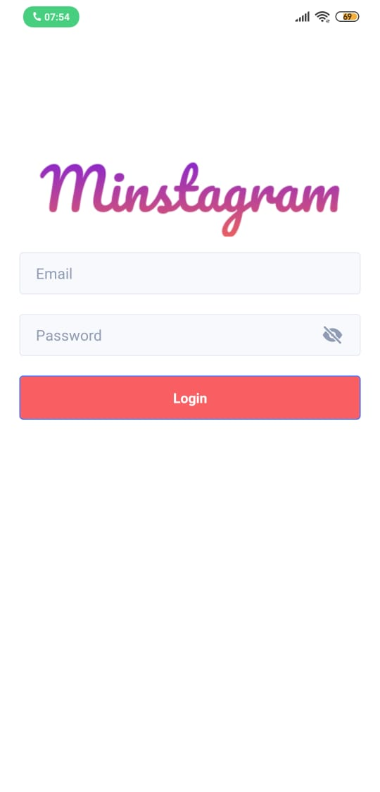
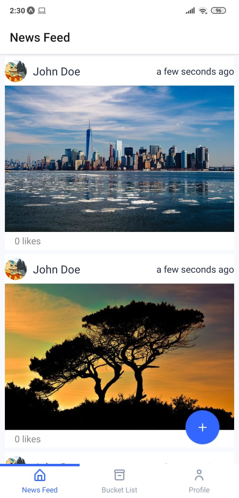

## Minstagram
a minimal instagram clone. by minimal, I mean its lack all the features.

built using react native, ui-kitten and redux (redux-toolkit and redux-saga)
## Running
start by running `yarn` 

then `yarn start` and `yarn mock-api` 

## Screenshots

